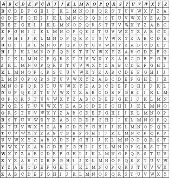

# VigenerePy - A simple Python 3.x class which implements the Vigenere cipher

The Vigenere cipher is a simple polyalphabetic substitution cipher
meant to secure messages with a password or keyword. According to *Principles
of Information Security* by Whitman and Mattord, "The cipher is implemented
using the Vigenere square (or table), also known as a tabula recta - a term
invented by Johannes Trithemius in the 1500s." The Vigenere square is made up
of 26 distinct cipher alphabets. In the header row and column, the alphabet is
written in its normal order. In each subsequent row, the alphabet is shifted
one letter to the right until a 26 x 26 block of letters is formed. This
implementation uses a keyword, or password, to represent the shift for each
letter.

To use the Vignere square, take the letter to be enciphered/deciphered and
find the row beginning with that letter. Next, take the letter of the keyword
to use and find it in the first row. Now, find the place where the row and
column intersect, and that letter is the enciphered or deciphered letter.
Now, use the next letter of the keyword to encipher/decipher the next letter
of the message. If you reach the last letter of the keyword but there are
still more letters left in the message, simply wrap around back to the first
letter of the keyword.

This project is a simple implementation of the Vigenere Cipher as a Python 3.x
class. It is meant to be easy to use, read, and modify. Valid passwords must
be at least one letter long and contain only letters. Numbers and symbols are
ignored. Also, passwords are case insensitive. Symbols and numbers
(including spaces) are ignored and removed from the ciphertext.  

**Available Methods**

* vigenere.Vigenere(string) - Return a vigenere object using string as the password

* vigenere.encrypt(string) - Encrypt the given string with the Vignere Cipher

* vigenere.decrypt(string) - Decrypt the given string with the Vigenere Cipher

* vigenere.setPassword(pass) - Change the current password/keyword to pass

**Example**

    from vigenere import Vigenere
    v = Vigenere("Password")
    c = v.encrypt("Hello world!")
    p = v.decrypt(c)
    print("Ciphertext: ", c)
    print("Plaintext: ", p)

Which outputs:

    Ciphertext:  WEDDK KFUAD
    Plaintext:   HELLO WORLD

**Contributing**

Pull requests, new feature suggestions, and bug reports/issues are
welcome.

**Versioning**

This project uses semantic versioning 2.0. Version numbers follow the
MAJOR.MINOR.PATCH format.

**License**

This project is licensed under the 3-Clause BSD License also known as the
*"New BSD License"* or the *"Modified BSD License"*. A copy of the license
can be found in the LICENSE file. A copy can also be found at the
[Open Source Institute](https://opensource.org/licenses/BSD-3-Clause)
